<!--
============================================================
Politécnica de Santa Rosa

Profesor: Jesús Salvador López Ortega
Archivo: README.md
Descripción: Documento principal del proyecto. Contiene instrucciones de instalación, uso, estructura y entorno reproducible.
============================================================
-->


# **Politécnica de Santa Rosa**

* **Carrera: ITIID**
* **Materia: Sistemas Operativos**
* **Profesor:** Jesús Salvador López Ortega ([LinkedIn](https://www.linkedin.com/in/jesus-salvador-lopez-ortega/) | [GitHub](https://github.com/chucholoport))

---

## **Índice**

- [**Politécnica de Santa Rosa**](#politécnica-de-santa-rosa)
  - [**Índice**](#índice)
  - [**Configuración del repositorio remoto en GitHub**](#configuración-del-repositorio-remoto-en-github)
    - [1. Accede a la organización y acepta la invitación](#1-accede-a-la-organización-y-acepta-la-invitación)
    - [2. Identifica el repositorio base de la materia](#2-identifica-el-repositorio-base-de-la-materia)
    - [3. Crea un Fork del repositorio de la organización](#3-crea-un-fork-del-repositorio-de-la-organización)
    - [4. Verifica tu Fork organizacional](#4-verifica-tu-fork-organizacional)
  - [**IDE de trabajo**](#ide-de-trabajo)
  - [**Instalación y configuración de entorno de trabajo**](#instalación-y-configuración-de-entorno-de-trabajo)
    - [Pasos en la terminal de Windows (CMD)](#pasos-en-la-terminal-de-windows-cmd)
    - [Pasos en la terminal de WSL2 (Ubuntu)](#pasos-en-la-terminal-de-wsl2-ubuntu)
  - [**Compilación y Ejecución de Pruebas**](#compilación-y-ejecución-de-pruebas)
    - [Usando macros de VS Code](#usando-macros-de-vs-code)
  - [**Contacto**](#contacto)

---

## **Configuración del repositorio remoto en GitHub**

> **Nota:** Usa tu correo personal para crear tu cuenta de GitHub. GitHub será tu portafolio profesional y lo conservarás después de graduarte.

En esta materia trabajaremos con repositorios alojados en la **organización oficial**:

**[https://github.com/upsrj-jlopez](https://github.com/upsrj-jlopez)**

Cada alumno deberá crear un **Fork organizacional** del repositorio base de la organización.

---

### 1. Accede a la organización y acepta la invitación

1. Revisa tu correo o tus notificaciones en GitHub.
2. Acepta la invitación para unirte a la organización `upsrj-jlopez`.
   
   * 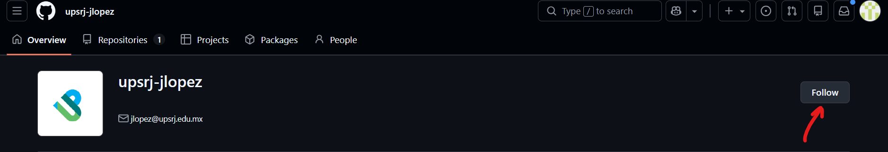
   
   * 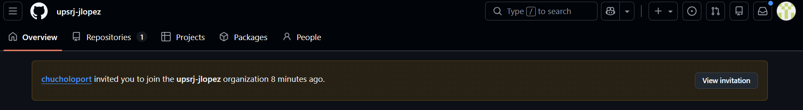

   * 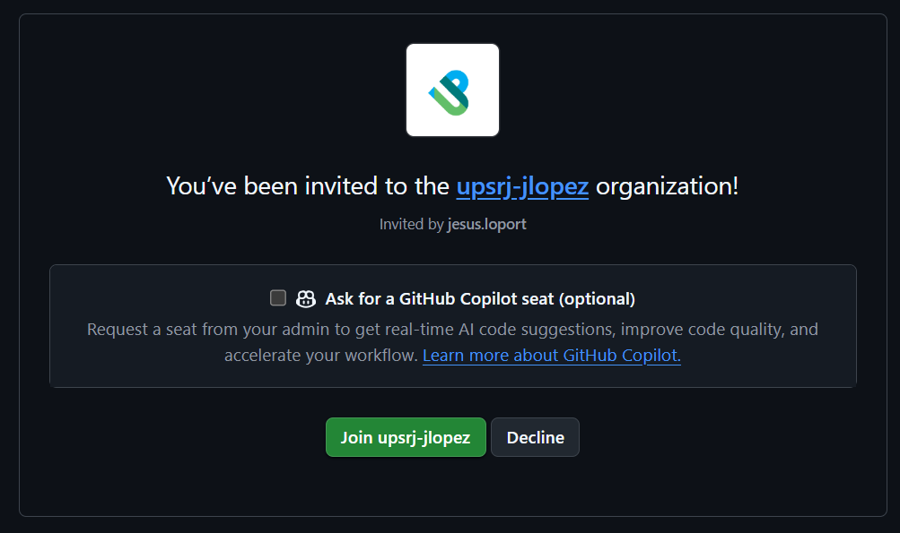

3. Verifica que puedes ver los repositorios desde tu navegador.
   
   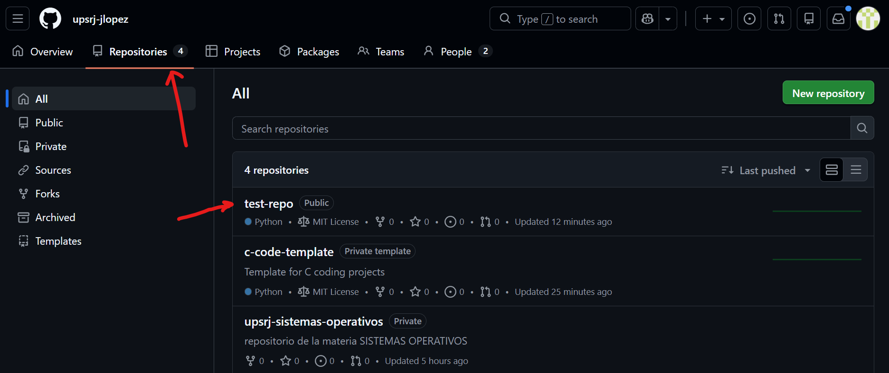

---

### 2. Identifica el repositorio base de la materia

1. Abre en tu navegador:

   [https://github.com/upsrj-jlopez](https://github.com/upsrj-jlopez)

2. Busca el repositorio correspondiente a tu materia (por ejemplo: `upsrj-fundamentos-de-programacion`).

---

### 3. Crea un Fork del repositorio de la organización

1. Entra al repositorio base de la materia.
2. Da clic en el botón **Fork** (esquina superior derecha).
   
   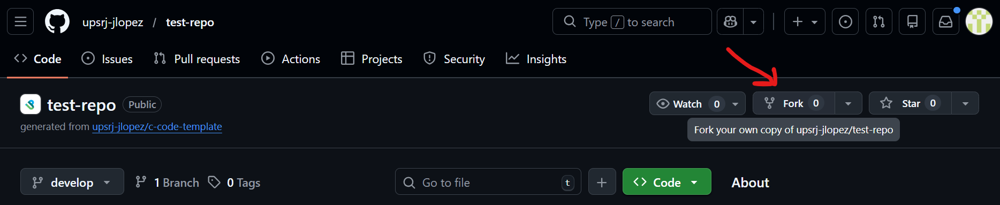

3. Selecciona la cuenta de la organización como destino del Fork.
4. agrega tu nombre de GitHub después de un `-` en el nombre del Fork.
5. Deja todas las demás opciones por default y confirma con **Create fork**.

   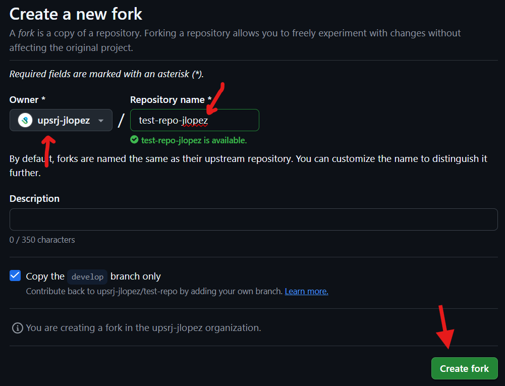

Esto creará una copia completa del repositorio dentro de la organización de GitHub.

---

### 4. Verifica tu Fork organizacional

1. Ve a tus organizaciones en tu perfil de GitHub.

   * 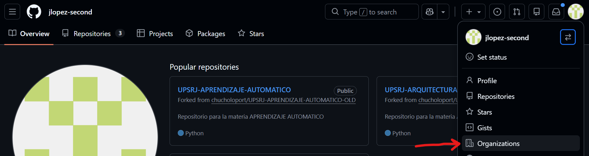

   * 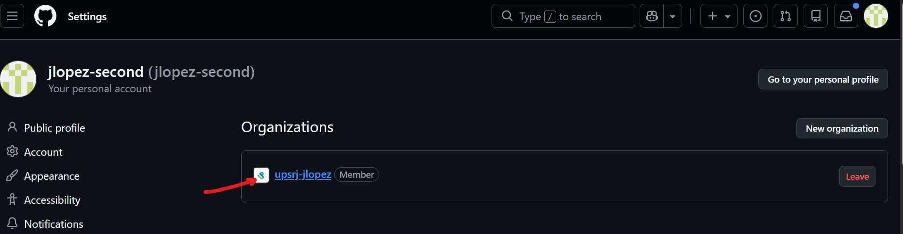

2. Confirma que ahora existe el repositorio de la materia con el nombre incluyendo tu usuario.

   * 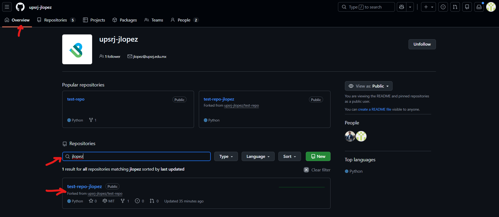

Ejemplo:

```
https://github.com/upsrj-jlopez/test-repo-jlopez
```

> **Importante:** Todo tu trabajo y entregas se harán sobre **tu Fork organizacional**.


🔙 [Volver al índice](#índice)

---

## **IDE de trabajo**

1. **Instala Visual Studio Code**

   Descarga Visual Studio Code desde:
   [https://code.visualstudio.com/](https://code.visualstudio.com/)

   Sigue el proceso de instalación con todas las configuraciones por default.

2. **Agrega las extensiones necesarias**

   * **WSL:** Permite conectar WSL con Visual Studio Code.

     

   * **Git Graph:** Visualiza el historial de tu repositorio.

     

   * **C/C++ Extension Pack (Microsoft):** Soporte para edición, compilación y depuración en C/C++.

      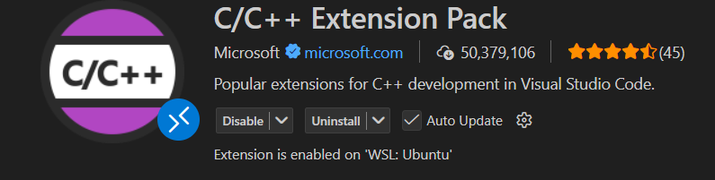

🔙 [Volver al índice](#índice)

---

## **Instalación y configuración de entorno de trabajo**

### Pasos en la terminal de Windows (CMD)

1. **Configurar permisos para ejecutar scripts en PowerShell**

   Si tienes una configuración restringida para correr scripts desde Windows, corre este comando en una terminal de **PowerShell (PS1)**:

   ```powershell
   Set-ExecutionPolicy RemoteSigned -Scope CurrentUser -Force
   ```

   > **Nota:** Si quieres cambiar la configuración para todos los usuarios, corre el siguiente comando en una terminal de **PowerShell (PS1) como administrador**:

   ```powershell
   Set-ExecutionPolicy RemoteSigned -Scope LocalMachine -Force
   ```

   Puedes confirmar tu configuración con el siguiente comando:

   ```powershell
   Get-ExecutionPolicy
   ```

2. **Instalar Windows Subsystem for Linux (WSL)**

   ```batch
   wsl --install
   ```

3. **Establecer WSL2 como default**

   ```batch
   wsl --set-default-version 2
   ```

🔙 [Volver al índice](#índice)

---

### Pasos en la terminal de WSL2 (Ubuntu)

1. **Actualizar el sistema**

   ```bash
   sudo apt update
   ```

2. **Instalar herramientas de compilación (build-essential)**

   Este paquete instala el compilador GCC, `make` y librerías básicas necesarias para compilar proyectos en C/C++.

   ```bash
   sudo apt install -y build-essential
   ```

   Puedes verificar la instalación con:

   ```bash
   gcc --version
   make --version
   ```

3. **Autenticación con GitHub usando el navegador y Visual Studio Code**

   En lugar de usar tokens manuales, utilizaremos el flujo moderno de autenticación con GitHub.

   1. **Inicia sesión en GitHub desde tu navegador (Windows)**

      * Abre tu navegador e inicia sesión en [https://github.com](https://github.com) con tu cuenta personal.

   2. **Clona el repositorio desde Visual Studio Code**

      * Abre Visual Studio Code y conectate a WSL.

         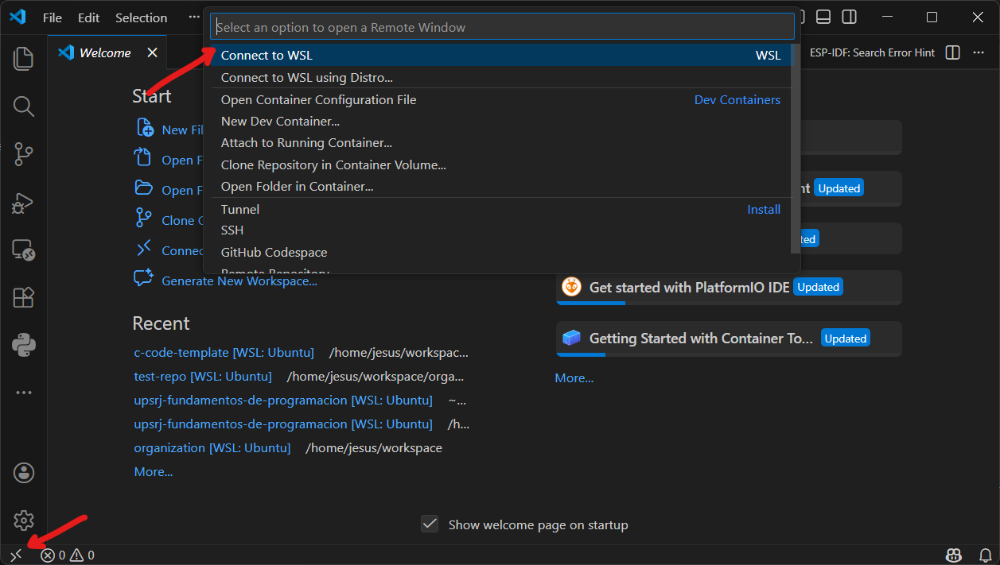

      * En la barra lateral izquierda: `Source Control` → `Clone Repository`. Posteriormente, selecciona `Clone from GitHub`.

         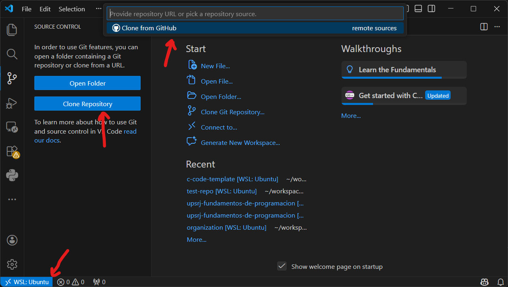

      * Pega la URL del repositorio cuando se te solicite.

         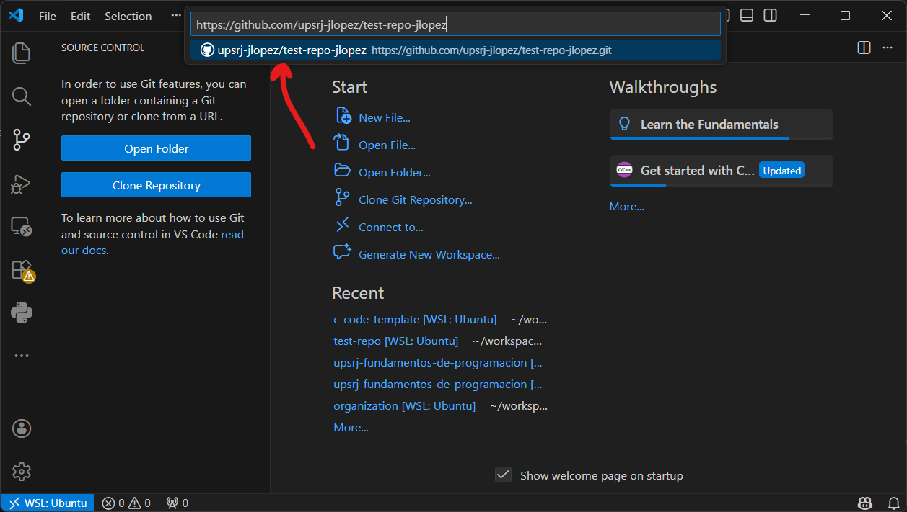

   3. **Autoriza Visual Studio Code con tu cuenta de GitHub**

      * Al clonar por primera vez, Visual Studio Code te preguntará si deseas iniciar sesión y enlazar tu cuenta de GitHub.

      * Acepta la solicitud.

      * Se abrirá una ventana del navegador para autorizar a Visual Studio Code.

      * Confirma la autorización.

      > **Nota:** Esto configura automáticamente el Git Credential Manager y ya no tendrás que ingresar usuario ni contraseña en futuros `git pull` o `git push`.

   4. **Configura tu nombre y correo en Git (una sola vez)**

      ```bash
      git config --global user.name "Tu Nombre"
      git config --global user.email "tu@email.com"
      ```

🔙 [Volver al índice](#índice)

---

## **Compilación y Ejecución de Pruebas**

> Los proyectos de la materia se compilan y ejecutan usando macros de Visual Studio Code.

### Usando macros de VS Code

1. Presiona:
   
   ```bash
   Ctrl + Shift + B
   ```

   Esto abrirá el menú de tareas configuradas para el proyecto.

   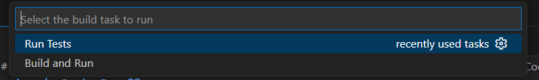

2. Selecciona una de las siguientes opciones:

   * **Build and Run** 
      Compila el proyecto y ejecuta el binario generado.

   * **Run Tests** 
      Compila y ejecuta la batería de pruebas automatizadas.

1. Observa la salida en la terminal integrada de Visual Studio Code.
   
   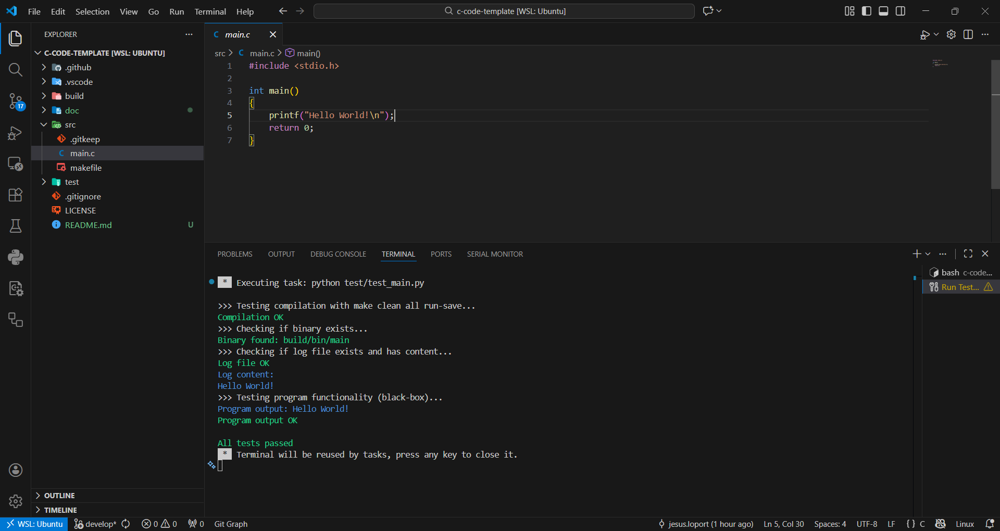

> **Nota:** 
> * Estas tareas están definidas en el archivo .vscode/tasks.json del repositorio.
> * No es necesario ejecutar make manualmente, ya que las macros se encargan de todo el flujo.

🔙 [Volver al índice](#índice)

---

## **Contacto**

¿Dudas? Consulta los archivos de ayuda o pregunta a tu instructor.

**Autor:** Jesús Salvador López Ortega
[LinkedIn](https://www.linkedin.com/in/jesus-salvador-lopez-ortega/) | [GitHub](https://github.com/chucholoport) | [Correo Institucional](mailto:jlopez@upsrj.edu.mx)

Actualizado: enero 2026

🔙 [Volver al índice](#índice)
